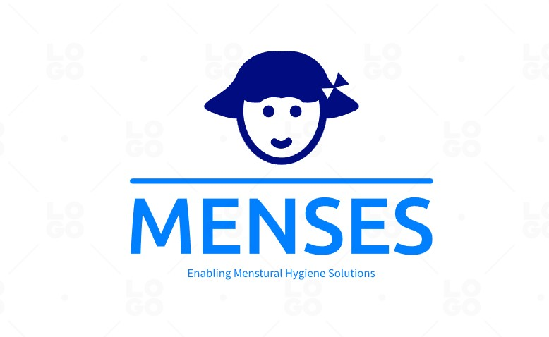

# Menses
Menses-Enables Menstrual Hygiene Solutions

<h2>In Development Phase 🚀</h2>

<h1>Problem Statement: </h1>

India has over 355 million menstruating women and girls, but millions of women across the country face uncomfortable and undignified experiences with menstrual hygiene management. Menses enables accessibility of menstrual hygiene solutions.

 
 
<h1> Proposed Solution</h1>

- Donation & Needy Platform ( Menses Project): It connects people who can’t afford menstrual products with donors listed on our platform. Donors such as NGOs, Government Bodies, Brands, and Individuals can register themselves.
- Menses Shop ( e-commerce): It provides home delivery of menstrual products to all menstruating women, Disabled people, and unrepresented genders.
- Menses Learn (educational platform): It provides content about best practices during menstruation, and 1:1 Counselling sessions to educate people.
- Community (open conversation and community): It is a community of all menstruating women to discuss their queries and lifestyle with the folks in the community.
